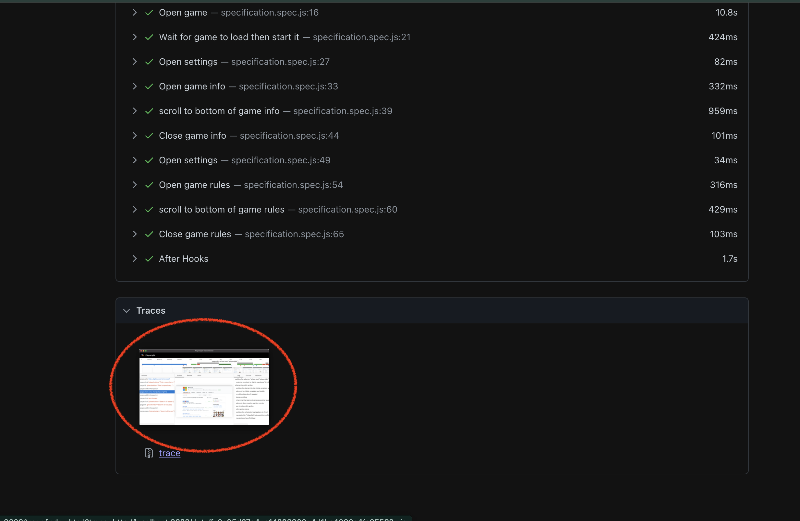
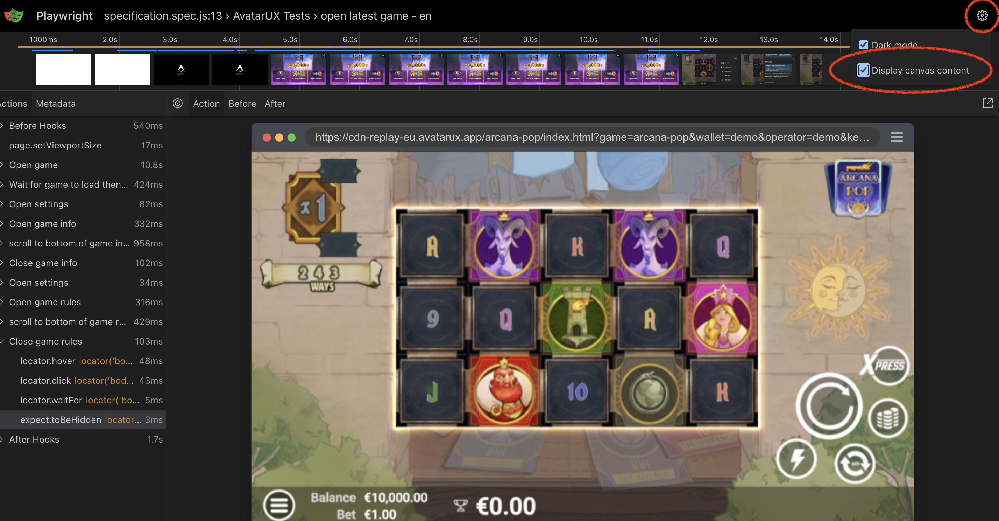

# Setup:

1) install node v20+
 -  install nvm/fnm then install node v20+
     -  `curl -o- https://raw.githubusercontent.com/nvm-sh/nvm/v0.39.1/install.sh | bash`
     -  `nvm install 20`
 - you can also follow instructions from https://nodejs.org/en/download

2) install dependencies: 
- `npm install`

#### how to run all tests: (from the root of the project)
 - `npx playwright test`

#### how to run specific tests:
 - `npx playwright test <relative-path-to-test-file>`

#### how to run tests in debug mode (with UI & code side by side):
 - add `--debug` to the command
 - example: `npx playwright test specification.spec.js --debug`
 - test can break if browser window is interacted with

#### how to view test results (including *screenshots*):
 - `npx playwright show-report`
 - in order to view the rendered canvas in the report, you need to open the trace window 
    - 
 - then check the option to do so from the top right corner
    - 

--- 

# Future improvements to test & framework:
 - as it stands, using specification.spec.js we can test multiple languages - just need to add the other locales to the localisation object
 - in order to test the localisation for the menus in this assignment, we don't need to navigate the game menus, as we can get the information from the DOM
 - integrate with the CI system available in the project
 - add tags to tests to run specific tests
 - annotate tests with links to specification and/or task management platform
 - we could listen to events for certain actions - currently we could use this to know when the game finished loading, how the game was interacted with (spin start/end, betchange, etc); other information could be provided this way as well
 - break down different localisation language strings into separate files and granulate strings into smaller strings
 - we could even expand the test for canvas-hidden elements to test the localisation of the game - playwright allows searching for images OR we could implement our own OCR